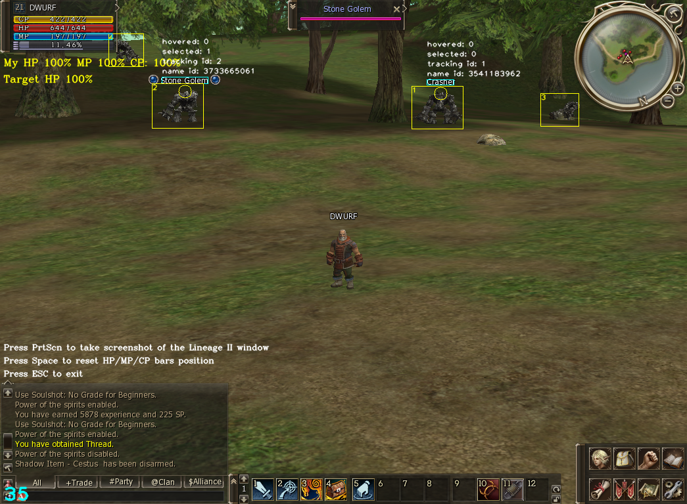

# WIP

Simple Lineage II bot that uses CV to find possible targets and monitor HP/MP/CP.

[](https://www.youtube.com/watch?v=nuiD7ezc-Lw "Video")

## Features

* NPC detection
* HP/MP/CP monitoring
* Mouse and keyboard emulation
* ~~Stuck resolving~~
* ~~TTS alarm subsystem (captcha, low HP, CP decreasing, etc.)~~
* ~~Custom behavior support (LUA scripts)~~
* ~~Buffs/debuffs monitoring~~

## How to use

**[Interception](https://github.com/oblitum/Interception) driver is required for mouse and keyboard emulation.**

1. Install [Interception](https://github.com/oblitum/Interception/releases) driver (start `cmd.exe` as Administrator, then run `install-interception.exe /install`) and reboot.
2. Run Lineage II client, select character and teleport to any exp/farm location.
3. Run `run.bat "<title of the Lineage II client window>"`.
4. HP/CP/MP bars must be 100% at the moment of bot start, but if not, you should wait until they will be 100% and then press Space to reset bars position.
5. To stop press ESC or move mouse.

Default keyboard layout:

* F1 - Primary attack
* F2 - Next target
* F3 - Spoil
* F4 - Sweep
* F5 - Pick up
* F6 - Restore HP
* F7 - Restore MP
* F8 - Restore CP

## Command line options

`l2-cv-bot.exe`:

```
--window    Lineage II window title or part of the title. Default: "Lineage II"
--debug     Show window with debug information. Default: true
```

`run.bat` only accepts window title.

## Customization

Current version developed and tested using Windows 10 and Gracia Epilogue client, so with another Windows or Lineage II client it may not work.

* Edit `run.bat` file to customize CV or keyboard layout for another client. Note that for colors are used HSV and **B**G**R** color models.
* Edit `Brain.cpp` to customize bot behavior. Custom runtime behavior scripts currently not supported.
* OS related stuff placed in these files: `Window.cpp`, `Capture.cpp`, `Input.cpp`, `Intercept.cpp`.

## Building

Using CMake and MSVC (Visual Studio 2017) on Windows:

1. [Download](https://cmake.org/download/) and install CMake.
2. [Download](https://opencv.org/releases.html) OpenCV binaries or [build](https://github.com/opencv/opencv) OpenCV manually (tested with OpenCV 3.4.2).
3. Set `OpenCV_DIR` environment variable to path of the OpenCV binaries.
4. Run `build-vs15x64.bat` for 64-bit OpenCV or `build-vs15x32.bat` for 32-bit OpenCV (or `build.bat` to provide custom arch, project generator and configuration).
5. Built executable and dependent dynamic libraries can be found in `build-<arch>/<configuration>` directory (e.g. `build-x64/Release`).

*If Interception library building fails, try to install [WDK](https://www.microsoft.com/en-us/download/details.aspx?id=11800).*